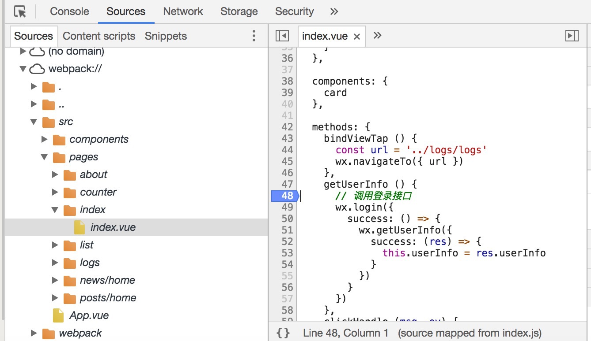

<script crossorigin="anonymous" src="//www.dpfile.com/app/owl/static/owl_1.5.28.js"></script>
<script>
Owl.start({
    project: 'mpvue-doc',
    pageUrl: 'build/index'
})
</script>

# 项目建构

## 开始
建构流程是整个项目最核心的地方之一，通过我们所熟知的 webpack，完成了 template 转换为 wxml 和 样式转换优化以及其他的若干代码的拼接压缩混淆等操作，最终使之可以运行在微信小程序的环境中。

如果你不了解什么是 webpack, 可以查看 [webpack文档](https://doc.webpack-china.org/) 。
用一个图来描述：
``` plaintext
// app.vue & main.js
+---------+                            +----------+   +---------+
| app.vue |  +                         | app.js   |   | app.json|
+---------+  |                         +----------+   +---------+
             +---------------------->
+---------+  |     webpack             +----------+
| main.js |  +                         | app.wxss |
+---------+                            +----------+

// page.vue & main.js
       +------------------------+
       v                        |
+-----------+      +-------+    |
| page.vue  | +--> | .sass |    |
++-+-+------+      +-------+    |
 | | |                          |
 | | |     +------------+       |
 | | +---> | common.css |       v                   +------+  +-------+
 | |       +-----+------+                           |  .js |  | .json |
 | |             |          +---------+             +------+  +-------+
 | |   +-----+   |          | main.js | +--------->
 | +-> | .js |   v          +---------+   webpack   +-------+ +-------+
 |     +-----+  ++------+                           | .wxml | | .wxss |
 |   +------+   | .font |                           +-------+ +-------+
 +-> | .jpg |   +-------+
     +------+
```

## 懒人专用
以下内容对于要自定义项目配置的同学可能很实用，但是很多同学只是想尝尝鲜，或者想快速搭建启动项目，所以出了个命令行工具（CLI），可以一键构建出需要的项目结构和配置，详见[mpvue/命令行工具（CLI）](/mpvue/#cli)。

一言以蔽之：

``` bash
# 全局安装 vue-cli
$ npm install --global vue-cli

# 创建一个基于 mpvue-quickstart 模板的新项目
$ vue init mpvue/mpvue-quickstart my-project

# 安装依赖，走你
$ cd my-project
$ npm install
$ npm run dev
```

## 编写配置

为了达到我们需要的编译目的，需要更新以下几个地方的 webpack 的配置，以下通过配置顺序来详细讲解。

### 更新依赖
``` bash
npm i mpvue -S
npm i mpvue-template-compiler mpvue-loader mpvue-webpack-target postcss-mpvue-wxss webpack-dev-middleware-hard-disk -S-D
```

你也可以通过指定项目 `.npmrc` 从而在安装过程中的避免设置镜像源。

### 入口和(Entry)

> mpvue-loader 1.0.7+

项目的源代码通过 webpack 配置的 entry 来识别页面入口，示例如下：
``` javascript
{
    // ...
    entry: {
        app: resolve('./src/main.js'),               // app 字段被识别为 app 类型
        'list/main': resolve('./src/pages/list/main.js'),   // 其余字段被识别为 page 类型
        'page1/main': resolve('./src/pages/page1/main.js')
    }
}
```

**注意：**
我们约定在 entry 中的 app 字段，会被识别为微信小程序中的 app 类型，会生成 `app.js` 和 `app.json`。

详细理解可以看 [mpvue-loader/#entry](/build/mpvue-loader/#entry) 相应的文档。

### 构建目标(Targets)

可能你之前都没有太关注过这个配置项目，因为默认的 target 是 web，符合了我们绝大部分项目的配置。
需要把 target 指定为我们专为微信小程序写的 target，示例代码如下：
``` javascript
{
  // ...
  entry: {
    // ...
  },
  target: require('mpvue-webpack-target')    // 改这里
}
```

关于这个特殊的 target，详见 [mpvue-webpack-target](/build/mpvue-webpack-target/) 的文档和介绍。

### 模块(Module)

这个环节主要修改 `module.rules`，会通过我们改写过的 [mpvue-loader](/build/mpvue-loader/) 处理源代码为我们期望的上文展示的文件目录格式和能够运行的代码，需要我们在 webpack 的配置中这样去使用她。

#### 更新 `/\.vue$/` rule 的 loader

需要把 `/\.vue$/` 后缀文件修改 `vue-loader` 为 `mpvue-loader`，结果示例如下：

``` javascript
{
  // ...
  module: {
    rules: [
      // ...
      {
        test: /\.vue$/,
        loader: 'mpvue-loader',  // 改这里
        options: vueLoaderConfig
      },
    ]
  }
}
```

#### 更新 `/\.js$/` rule 的 loader

给所有 `js` 后缀文件增加 `mpvue-loader`，并且需要加 options，结果如下：

``` javascript
{
  // ...
  module: {
    rules: [
      // ...
      {
        test: /\.js$/,
        include: [resolve('src'), resolve('test')],
        use: [                                       // 改这里
          'babel-loader',
          {
            loader: 'mpvue-loader',
            options: {
              checkMPEntry: true
            }
          },
        ]
      },
    ]
  }
}
```

关于这个 loader，详见 [mpvue-loader](/build/mpvue-loader/) 的文档和介绍。

### 解析(Resolve)
#### resolve.alias
通过 alias 来覆盖原 `vue.runtime` 为我们改写过后的 `mpvue.runtime` ，如下：

```
{
  resolve: {
    // ...
    alias: {
        'vue': 'mpvue',
        // ...
    }
  }
}
```

这样就可以在项目中直接使用 `import Vue from 'vue` ，保持更好兼容性和最小侵入业务代码。

### postcss 插件
用来处理的 WEB style 规范的样式为微信小程序的 wxss 规范的样式，包含不限于清理掉微信小程序不支持样式，转换 rem 单位到 rpx等。

#### postcss-mpvue-wxss
如果使用了 vue-loader 或者 mpvueloader，那么应该配置在 vue loader options，如下：

```
{
  vue: {
    loaders: utils.cssLoaders(),
    postcss: [
      // ...
      require('postcss-mpvue-wxss')
    ]
  },
}
```

或者更直接方式是修改项目的根目录下的 `.postcssrc.js` ，当然这需要一定的版本支持，如下：
``` javascript
// https://github.com/michael-ciniawsky/postcss-load-config

module.exports = {
  "plugins": {
    // to edit target browsers: use "browserslist" field in package.json
    "autoprefixer": {},
    "postcss-mpvue-wxss": {}
  }
}
```

详细的文档，请参见 [postcss-mpvue-wxss](/build/postcss-mpvue-wxss/)

#### px2rpx-loader
配置方式同上 `postcss-mpvue-wxss` 插件。
详细的文档，请参见 [px2rpx-loader](/build/px2rpx-loader/)

### 热更新
主要依赖于 `webpack-dev-middleware-hard-disk` 这个工具，将 dev 模式下，缓存在 JS 内存中的文件全部映射创建到硬盘，从而借助微信小程序的调试工具文件变化自动刷新功能，进行热更新的模拟。

只需要编写类似 `webpack/dev-server.js` 的如下代码即可：

```
var config = require('./config')
if (!process.env.NODE_ENV) {
  process.env.NODE_ENV = JSON.parse(config.dev.env.NODE_ENV)
}

var path = require('path')
var webpack = require('webpack')
var webpackConfig = require('./webpack.dev.conf')
var compiler = webpack(webpackConfig)

require('webpack-dev-middleware-hard-disk')(compiler, {
  publicPath: webpackConfig.output.publicPath,
  quiet: true
})
```

### 提醒

#### 建构中 NODE_ENV 环境配置

最简单的配置环境变量的方式，解决报错程度和是否生成单独的 wxss 等。

```
process.env.NODE_ENV = 'production'
```

#### 增加 .eslintrc.js 全局白名单
```
{
  // ...
  globals: {
    App: true,
    Page: true,
    wx: true,
    getApp: true,
    getPage: true
  }
}
```


## 预览和调试
### 开发调试
build 后的可以运行的代码请直接用 `微信 web 开发者工具` 打开进行调试。若对其不熟悉，可以看相关文档：[开发者工具](https://mp.weixin.qq.com/debug/wxadoc/dev/devtools/devtools.html)。

### Debug

> mpvue-loader 1.0.7+ 

关闭微信开发者工具的 ES6 转 ES5 ，就可以打 debug 啦，如图：

### 真机调试
真机调试的时候必须要 AppID，[获取微信小程序的 AppID](https://mp.weixin.qq.com/debug/wxadoc/dev/)。
