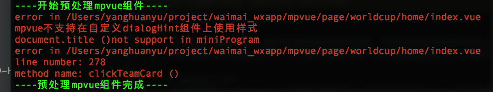
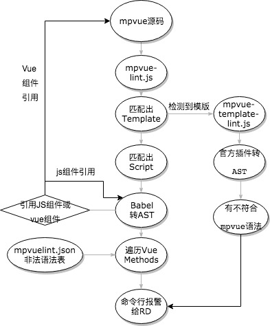

# mpvue-lint

>针对很多需要h5和小程序页面同构开发的场景，开发者会出现很多h5的vue组件直接搬到mpvue中调试的开发流程。虽然mpvue支持大部分的vue语法，但是仍有些边界
情况需要开发者自行处理。为了提升开发效率，我们提供mpvue-lint插件。目前有两个功能模块，语法检查模块和内存检查模块

# mpvue-lint 语法检查
语法检查模块,mpvue-lint检测h5版本的vue组件是否符合mpvue语法规则

##使用方法 npm install mpvue-lint
构建流中调用，传入entry(array) ,要检查的入口Vue文件列表 ,示例代码：
```javascript
const mpvueLint = require('mpvue-lint')
mpvueLint.build(
{
	entry:
	[
	   path.resolve('mpvue/page/worldcup/home/index.vue'),
	   path.resolve('mpvue/page/worldcup/card_detail/index.vue'),
	   path.resolve('mpvue/page/worldcup/activity_rules/index.vue')
	]
})
```

如果有引用路径的错误，会报白色提示</br>
如果有template错误，比如组件上用class,绑定click事件等会报**红色**错误名，文件名，和组件名</br>
如果Vue文件方法里有写法错误，如使用zepto,window,document等，会报**红色**错误名，文件名，方法名，行号</br>
如果想自定义需要报错的函数调用，请按照**mpvuelint.json**里的格式添加你的函数名，例如,"zepto":true会在 vue文件中所有调用zepto的地方报错提醒</br>
lint检查非强制阻拦编译过程，FE同学自己根据提醒修改业务代码

运行结果如图：</br>


# mpvue-trace 内存检查
>内存检查模块,mpvue-trace辅助开发者检查操作时数据更新的变化，因为最后小程序更新数据需要调用setData接口，而setData小程序真机是
通过把JSON对象转换字符串传递给实际的页面的，大块数据会造成页面卡顿，甚至极端情况会造成页面少渲染一部分(更新数据过大会丢弃一部分更新)。
为了开发者更直观看到mpvue页面每次更新数据量，这个插件会检查每次数据更新后500ms内整个页面的数据更新总量。

##使用方法 npm install mpvue-lint
在mpvue/你的工作目录/你的页面目录/main.js中加入如下引用
```javascript
const mpvueTrace = require('mpvue-lint/mpvue-trace')
mpvueTrace.trace(Vue); //Vue是当前页面中的Vue实例
```
##使用注意！
上面的调试代码会监听Vue.$updateDataToMP方法并把更新数据转字符串计算大小，会有一定性能损耗，仅做调试trace用，**上线代码一定要去除**。

#源码

> mpvue-lint的源码已在github上开源[github 地址请参见](https://github.com/mpvue/mpvue-lint) 欢迎开发者们根据自己项目的情况灵活增减功能

源码基本原理图：</br>


<script src="../assets/cat.js">
